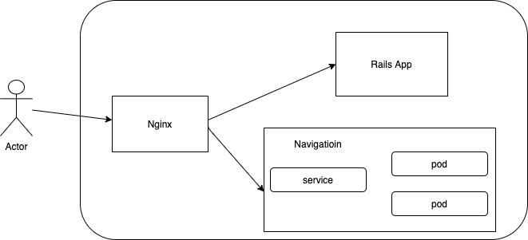

# Question
### An explanation of how the navigation app’s API works
```
client fire an API call with /navigation?start=8.681495%2C49.41461&end=8.687872%2C49.420318. nginx will pass to localhost:8081/navigation?start=8.681495%2C49.41461&end=8.687872%2C49.420318
```

### A more detailed diagram of how the new resources fit into the existing architecture


### How you would deploy it to a production environment
```
The application is created with a docker image. When deploy, we just need to create a k8s service and depolyment
```

### How you would test it
```
Randomly generate a pair of coordination and use it to call navigation api
```

### What challenges you had, what you didn’t have time for, and what you would change
```
1. I was not familiar with openroutesevice and OSM file. took time to figure out what these are but still don't know what I need to do for OSM file
2. I didn't have time to get enough knowledge that how make openroutesevice and OSM file work together. 
3. I just updated docker-compose.yml of openrouteservice with the OSM file path
```

# Here are some questions to guide what we’re looking for
### How do the new resources scale
```
Since the service is running on k8s, we just need to create new pod then it can be scaled
```

### If you used the smaller Heidelberg OSM file, how would you adapt the app to use the much larger one for Northern CA
```
I did not figure our this part becasue I did not get idea what should I do for this
```

### How does your infrastructure handle security
```
1. Use network firewall policy
2. Only restricted user can have admin permission
3. Don't store user password in application. It should be store it a place where is higher secure. e.g. AWS Secret Manager 
```

### How might you add a layer of protection to require users to authenticate with the Rails app in order to use the navigation service
```
After user logged in, Rails app should return a token to user. User need to use this token to call navigation api
```
